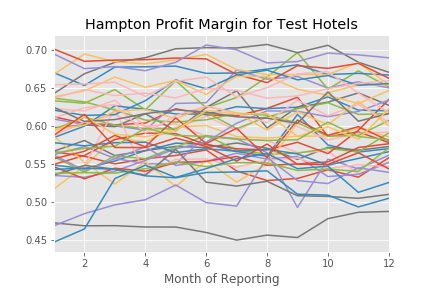

# FEELING THE IMPULSE TO BUY


### BACKGROUND
ImpulsePoint by Impulsify is a top-rated front desk point-of-sale and retail management system for hotel lobbies. It automates nearly the entire retail system, from inventory maintenance to guest checkout. This system is built on data and it allows hotels to focus on exactly what guests want and respond accordingly. 

Impulsify's data science request was to create an interactive platform for potential hotel clients. They would input their brand, the number of rooms in their hotel, the current average monthly revenue for pre-existing retail space, and their current profit or profit margin. These metrics would be used to predict their sales per occupied room (SPOR), future revenue and profit, the increase in revenue and profit and the estimated return on investment percentage. 


### QUESTION/GOAL
Can these limited input metrics be used to create an accurate prediction of how a hotel will perform after introducing an Impulsify system? How does each effect the error of that prediction and of the model?


### RAW DATA
Impulsify provided 2 separate datasets. The first was a large .dump file containing 74 SQL tables. The tables varied massively in size but encompassed every metric they measure for a given store, as well as information about the hotel, the users, and the products. The timeframe for the data points was 2013-2018 and did not have any built in measure of performance.


The second dataset, which was the only one tested, was an .xlsx file contained performance information for the hotels across all brands for 2019. 

```
performance_2019 = pd.read_excel('../data/2019_sales_by_month.xlsx')
performance_2019.head()
```


Both datasets contained information gathered from individuals by manual entry as well as machine recorded by their system. There were errors and discrepancies in the manually entered data, but overall, there were not so many holes or duplicates as to make the data extraordinarily hard to work with. 

### EDA 


Much of the first data set was explored prior to recieving the 2019 numbers. The sheer volume of data points was certainly enough to pull out some older performance information, had that been what Impulsify chose to do. It could still be used to improve RMSE and additional modeling with the extra data.

Next up, exploration and organization of the 2019 performance Excel sheet. Impulsify wanted to just use this set and specifically test on the performance of each brand separately. This led to a subdivision of metrics until 3 remained on which to model predictions. They chose to disregard much of the information reported as well, as it isn't possible for smaller or unique hotels to be representative of, or comparative to, a large brand like Hilton or Marriott, which encompass thousands of hotels with every levels of service from budget to luxury. 

### ANALYSIS

##### CLEANING
The cleaning pipeline started with converting an Excel sheet to a pandas dataframe. That was then used to drop hotels with various characteristics and measures, identify and replace duplicate values, and separate by brand.

```
test_hotels['Brand'].value_counts()

Output:
Hampt    626
Hilto    581
Tru b    431
Homew    235
Embas    186
Home2    157
Crown    151
Doubl     73
The S     15
La Qu     12
Hotel     12
Inter     12
Avid      12
Candl     12
Holid     11
Comfo     11
Name: Brand, dtype: int64
```




##### MODELING

The model applied was a basic linear regression performed on subsets of only Hilton and Hampton Inn performance data for 2019. The model was able to make predictions on both with a reasonably low RMSE. 

```
RMSE for Hilton training set  0.11647284683932572
RMSE for Hilton test set  0.12274394435474686

RMSE for Hampton training set  0.02910009138352963
RMSE for Hampton test set  0.05382803644606791
```

### RESULTS

This model seems to predict fairly well and given the limited number of requested features I was somewhat surprised. It performed better on Hampton data and I believe this is because it is a larger subset. This data can definitely be used to predict future performance for potential clients, especially considering the whole system is not hyper-specific to begin with, but meant to give a close ballpark estimate of how a new system will impact revenue. 

### FUTURE WORK
I would like to be less brand specific for training and be able to apply the model over all brands to see how much each brand effects the error. Implementation of a recommender and it's platform would be the end result of a successful Capstone 3 on this project.


#### CITATIONS AND PHOTO CREDITS
1. All data is proprietary property of Impulsify Inc. I have not provided any non-anonomized data for that reason and to protect their intellectual property. 
2. The Impulsify logo and store front are both images grabbed from the company's website, found at [www.impulsifyinc.com](https://www.impulsifyinc.com/).

